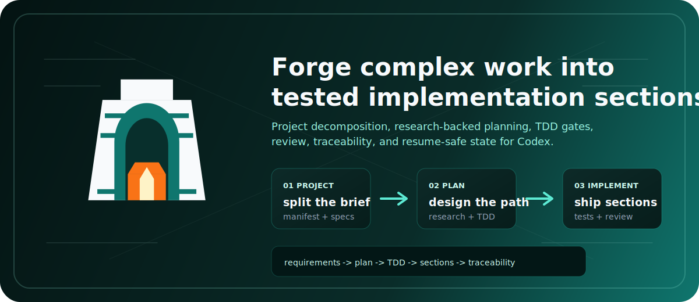
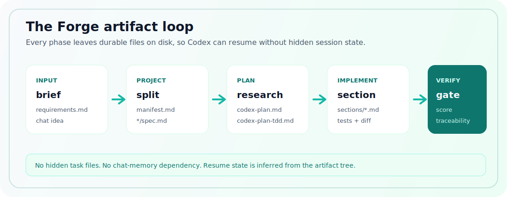

<div align="center">
  
  <h1>Zagrosi Forge</h1>
  <p><strong>Codex-native project decomposition, research-backed planning, TDD implementation, and quality gates.</strong></p>
  <p>
    <a href="https://github.com/zagrosi-code/zagrosi-forge"></a>
    
    
  </p>
  
</div>

Zagrosi Forge turns broad software work into a file-backed engineering workflow:
split the project, write a reviewed TDD plan, implement bounded sections, and
verify the artifacts before shipping. It is built for Codex sessions that need
durable state, clear scope, and a stronger process than "prompt, patch, hope."

## What You Get

| Workflow | Use It For | Durable Output |
|----------|------------|----------------|
| `$zagrosi-forge:zagrosi-project` | Split a broad idea or requirements file into focused planning units | `project-manifest.md` and child `spec.md` files |
| `$zagrosi-forge:zagrosi-plan` | Turn one spec into a researched, reviewed TDD implementation plan | `codex-plan.md`, `codex-plan-tdd.md`, governance files, and `sections/` |
| `$zagrosi-forge:zagrosi-implement` | Build section files with tests, review, documentation, git hygiene, and scope checks | completed sections, review notes, implementation state, and traceability updates |



## Install

Prerequisites: Codex with plugin support, Python 3.11 or newer, and optionally
`uv` for running the full test suite.

```bash
git clone https://github.com/zagrosi-code/zagrosi-forge.git
cd zagrosi-forge
python3 scripts/zagrosi_skills.py install --pretty
```

The installer validates the package, backs up `~/.codex/config.toml` when it
changes, writes the local marketplace entry, copies Forge into Codex's plugin
cache, and verifies the skills with `codex debug prompt-input` when the `codex`
CLI is available. Restart Codex after the installer reports success.

```bash
# Preview config/cache changes without writing them.
python3 scripts/zagrosi_skills.py install --dry-run --pretty

# Check whether the installed plugin cache matches this checkout.
python3 scripts/zagrosi_skills.py update-check --pretty

# Refresh Codex's local plugin cache from this checkout.
python3 scripts/zagrosi_skills.py self-update --pretty
```

Forge does not poll git remotes automatically. Pull newer source when you want
it, then run `update-check` or `self-update` to sync Codex's local plugin cache.

The Codex CLI also supports a marketplace flow:

```bash
codex plugin marketplace add zagrosi-code/zagrosi-forge
codex plugin add zagrosi-forge@zagrosi
```

The local installer remains the recommended path for this repository because it
also runs Forge's validation and update checks.

<details>
<summary>Manual install</summary>

Add the local marketplace and plugin entry to `~/.codex/config.toml`:

```toml
[marketplaces.zagrosi]
source_type = "local"
source = "/absolute/path/to/zagrosi-forge"

[plugins."zagrosi-forge@zagrosi"]
enabled = true
```

Then copy this package into the versioned cache path shown in
`.codex-plugin/plugin.json`, for example:

```text
~/.codex/plugins/cache/zagrosi/zagrosi-forge/0.2.0/
```

</details>

## Quick Start

Use the skills directly inside Codex:

```text
Use $zagrosi-forge:zagrosi-project to split this idea: improve billing, auth, and dashboard workflows for our SaaS app.
Use $zagrosi-forge:zagrosi-project on @planning/requirements.md
Use $zagrosi-forge:zagrosi-plan on @planning/01-auth/spec.md
Use $zagrosi-forge:zagrosi-implement on @planning/01-auth/sections/.
```

Or run the helper CLI for deterministic checks and reports:

```bash
python3 scripts/zagrosi_skills.py doctor --plugin-root . --strict --pretty
python3 scripts/zagrosi_skills.py status --path planning/01-auth --pretty
python3 scripts/zagrosi_skills.py plan --file planning/01-auth/spec.md --plugin-root . --pretty
python3 scripts/zagrosi_skills.py implement --sections-dir planning/01-auth/sections --target-dir .
```

## Artifact Contract

Forge artifacts are designed to survive context compaction, handoff, and later
resume. Planning files include a machine-readable metadata block near the top:

```markdown
<!-- FORGE_META
{
  "artifact_type": "implementation_plan",
  "workflow": "zagrosi-plan",
  "depth_mode": "standard",
  "requirement_ids": ["REQ-001"]
}
END_FORGE_META -->
```

| Artifact | Why It Exists |
|----------|---------------|
| `project-manifest.md` | Records split units, dependency order, and project-level decisions |
| `codex-interview.md` | Captures questions, constraints, assumptions, and user answers |
| `codex-research.md` / `codex-evidence.md` | Preserve source-backed research and codebase observations |
| `codex-plan.md` | Gives Codex a concrete implementation design, phase plan, contracts, and file map |
| `codex-plan-tdd.md` | Turns requirements into test-first coverage and verification strategy |
| `sections/*.md` | Slices implementation into bounded, reviewable work packets |
| `traceability.md` | Connects requirements to plan, tests, sections, and implementation state |

Legacy `DEEP_META` blocks are accepted for migrated Deep Trilogy artifacts.

## Quality Gates

Forge gates return machine-readable findings, a score, and a success flag. They
are intentionally strict enough to catch vague sections, oversized plans,
missing rollback coverage, orphaned requirements, weak evidence, and drift
between a section and the patch being shipped.

| Profile | Bias |
|---------|------|
| `solo` | Balanced defaults for personal or small-project work |
| `startup` | Scope control and speed with practical testing |
| `enterprise` | Security, traceability, migration, and readiness |
| `regulated` | Maximum traceability, privacy, security, and rollback rigor |
| `oss-maintainer` | Reviewability, test coverage, and contributor-friendly scope |

| Artifact | Fast | Standard | Deep |
|----------|------|----------|------|
| implementation plan | 900+ words | 2,500+ words | 5,000+ words |
| TDD plan | 450+ words | 1,200+ words | 2,000+ words |
| implementation section | 250+ words | 1,000+ words | 1,500+ words |
| review file | 500+ words | 1,000+ words | 1,800+ words |

```bash
python3 scripts/zagrosi_skills.py forge-score --planning-dir planning/01-auth --depth standard --strict
python3 scripts/zagrosi_skills.py lint-plan --planning-dir planning/01-auth --profile enterprise --strict
python3 scripts/zagrosi_skills.py lint-sections --planning-dir planning/01-auth --export reports/sections.sarif --export-format sarif
python3 scripts/zagrosi_skills.py release-check --plugin-root . --pretty
```

`release-check --plugin-root .` includes the example snapshot gate when the
source-tree `examples/` fixtures are present. In mirrored plugin bundles, it
skips example-only gates and still validates the package surface.

## Helper CLI

`scripts/zagrosi_skills.py` is deliberately plain: it reads files, validates
contracts, prints JSON, and exits non-zero when a gate blocks progress. Add
`--pretty` for human-readable output; omit it for stable JSON in scripts and CI.

| Command | Purpose |
|---------|---------|
| `commands` | Discover command groups without reading the whole argparse listing |
| `project-setup`, `plan-setup`, `implement-setup` | Run phase-aware setup and preflight checks |
| `preflight`, `postflight` | Expose the same gates the setup commands run automatically |
| `status`, `next-section`, `context-brief` | Resume from durable artifacts and find the next useful action |
| `forge-score`, `report`, `traceability` | Inspect plan quality, readiness, and requirement coverage |
| `implementation-drift`, `patch-scope` | Compare changed files against planned section ownership |
| `eval-suite`, `release-check` | Run benchmark fixtures and publish-time validation |

For command discovery, run `commands --pretty` or `commands --phase plan`.
Plan-aware status reports the current planning directory, section progress,
`plan_artifacts`, and next action. `codebase-evidence --write` records expanded codebase evidence, including runtime files, source files, tests, skills, plugin metadata, CI, examples, eval metadata, and candidate commands.

Automatic flight reports can be tuned per command:

| Mode | Behavior |
|------|----------|
| `auto` | Default. Block only gates that already fail at high/critical severity. |
| `strict` | Treat medium findings as blocking too. |
| `advisory` | Run gates and report findings without blocking the wrapper. |
| `off` | Skip automatic flight reports. |

<details>
<summary>Command examples</summary>

```bash
# Project
python3 scripts/zagrosi_skills.py project-setup --brief "Build a SaaS app with auth, billing, and dashboard workflows." --planning-dir planning/saas
python3 scripts/zagrosi_skills.py project --file planning/requirements.md
python3 scripts/zagrosi_skills.py lint-project-manifest --planning-dir planning

# Planning
python3 scripts/zagrosi_skills.py plan-setup --file planning/01-auth/spec.md --plugin-root .
python3 scripts/zagrosi_skills.py lint-evidence --planning-dir planning/01-auth --strict
python3 scripts/zagrosi_skills.py lint-implementation-readiness --planning-dir planning/01-auth --strict
python3 scripts/zagrosi_skills.py plan-check-sections --planning-dir planning/01-auth
python3 scripts/zagrosi_skills.py agent-prompts --planning-dir planning/01-auth --type all

# Implementation
python3 scripts/zagrosi_skills.py implement-setup --sections-dir planning/01-auth/sections --target-dir .
python3 scripts/zagrosi_skills.py implementation-packet --planning-dir planning/01-auth --section section-01-auth
python3 scripts/zagrosi_skills.py tdd-skeletons --planning-dir planning/01-auth --framework pytest
python3 scripts/zagrosi_skills.py implement-record-section --sections-dir planning/01-auth/sections --section section-01-auth

# Reporting and release
python3 scripts/zagrosi_skills.py codebase-evidence --target-dir . --planning-dir planning/01-auth --write
python3 scripts/zagrosi_skills.py report --planning-dir planning/01-auth --output reports/forge.html
python3 scripts/zagrosi_skills.py eval-suite --examples-dir examples --check-snapshots --output examples/evals/latest.json
python3 scripts/zagrosi_skills.py release-check --plugin-root .
```

`eval-suite --examples-dir examples --check-snapshots` never updates golden
files. Maintainers must opt in with `--update-snapshots`.

</details>

Old `zagrosi-*` and upstream-style `deep-*` helper command names remain as
aliases for compatibility.

## Examples And Domain Packs

| Path | Purpose |
|------|---------|
| `examples/saas/` | Python-style SaaS planning fixture |
| `examples/typescript-app/` | TypeScript app fixture with dependent sections |
| `examples/deep-review/` | Deep-mode migration scenario starter for review benchmarking |
| `examples/gallery/` | Scenario starters for Next.js, FastAPI, Rails, Go, data migration, and AI-agent projects |
| `examples/evals/` | Benchmark metadata and golden Forge Score snapshots |
| `examples/invalid/` | Negative fixtures for missing evidence, bad governance, oversized sections, vague sections, and absent indexes |

`$zagrosi-forge:zagrosi-plan` can load focused references for common risk areas:

| Domain Pack | Use For |
|-------------|---------|
| `domain-auth.md` | auth, sessions, OAuth, identity, permissions |
| `domain-frontend.md` | UI workflows, forms, browser states |
| `domain-payments.md` | billing, checkout, webhooks, entitlements |
| `domain-data-migration.md` | schemas, backfills, expand/contract work |
| `domain-ai-products.md` | LLM workflows, tools, evals, safety |
| `domain-infra.md` | deployment, secrets, observability, operations |

## Migrate Old Artifacts

```bash
python3 scripts/zagrosi_skills.py migrate --planning-dir planning/01-auth
```

The migrator copies recognized `claude-*.md` artifacts to `codex-*.md` names and
adds Forge governance stubs when useful.

## Package Map

```text
.agents/plugins/marketplace.json  local Codex marketplace entry
.codex-plugin/plugin.json         Codex plugin manifest
assets/                           icon and README visuals
skills/zagrosi-project/           project decomposition skill
skills/zagrosi-plan/              planning and sectioning skill
skills/zagrosi-implement/         implementation skill
scripts/zagrosi_skills.py         deterministic helper CLI
scripts/deep_skills.py            backward-compatible wrapper
examples/                         valid and invalid workflow fixtures
tests/                            CLI and gate tests
```

## Validate

```bash
uv run --with pytest python -m pytest
python3 scripts/zagrosi_skills.py doctor --plugin-root . --strict --pretty
python3 scripts/zagrosi_skills.py release-check --plugin-root . --pretty
plugin-scanner verify .
python3 -m json.tool .codex-plugin/plugin.json >/dev/null
python3 -m json.tool .agents/plugins/marketplace.json >/dev/null
```

Zagrosi Forge is MIT licensed and includes attribution in [NOTICE.md](NOTICE.md).
