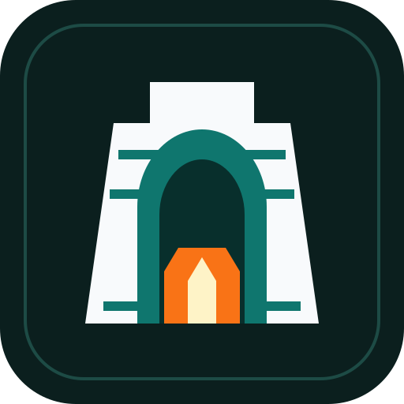
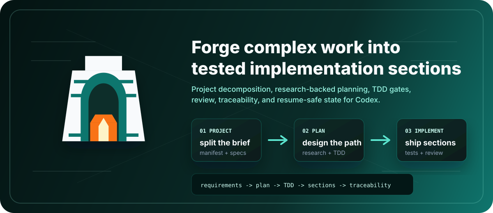
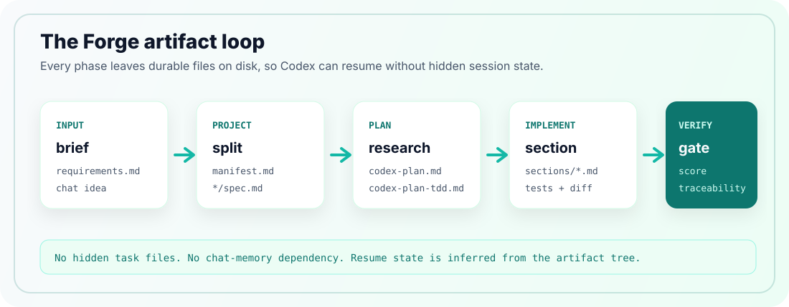

<div align="center">
  
  <h1>Zagrosi Forge</h1>
  <p><strong>Lean Codex workflows for project decomposition, planning, and test-first implementation.</strong></p>
  <p>
    <a href="https://github.com/zagrosi-code/zagrosi-forge"></a>
    
    
  </p>
  
</div>

Forge turns a broad request into bounded specs, an implementation-ready plan,
and tested code. Lean mode is default: fewer files, shorter prompts, one setup,
one final gate.

## Lean By Default

| Mode | Use |
|------|-----|
| `lean` | Default. Minimum sufficient artifacts and focused checks. |
| `standard` | Explicit opt-in for wider research, traceability, or coordination. |
| `deep` | Explicit opt-in for high-risk or architecture-heavy work. |

Forge has no minimum prose quotas. Gates check meaning: requirements, decisions,
file ownership, tests, risks, and completion evidence. Size caps stop artifacts
from becoming context dumps. Extra research, interview, TDD, governance, and
traceability files appear only when material or explicitly requested.

## Install

Requires Codex plugin support and Python 3.11+.

```bash
git clone https://github.com/zagrosi-code/zagrosi-forge.git
cd zagrosi-forge
python3 scripts/zagrosi_skills.py install --pretty
```

Restart Codex after success. Preview with `install --dry-run --pretty`; compare
the installed cache with `update-check --pretty`; refresh it with
`self-update --pretty`.

Codex marketplace install is also supported:

```bash
codex plugin marketplace add zagrosi-code/zagrosi-forge
codex plugin add zagrosi-forge@zagrosi
```

## Use

Invoke the three skills in order, or start at the phase you need:

```text
Use $zagrosi-forge:zagrosi-project on @planning/requirements.md
Use $zagrosi-forge:zagrosi-plan on @planning/01-auth/spec.md
Use $zagrosi-forge:zagrosi-implement on @planning/01-auth/sections/
```



Lean output stays small:

| Workflow | Required output |
|----------|-----------------|
| Project | `project-manifest.md` and child `spec.md` files |
| Plan | `codex-plan.md`, `reviews/codex.md`, `sections/index.md`, compact `section-*.md` files |
| Implement | Tests, code, and compact machine-readable section records |

Each phase runs one setup command, performs the work, then runs one strict
postflight. Example:

```bash
python3 scripts/zagrosi_skills.py plan-setup \
  --file planning/01-auth/spec.md --plugin-root . --depth lean
# Write and review the plan and sections.
python3 scripts/zagrosi_skills.py postflight \
  --phase plan --planning-dir planning/01-auth --depth lean --strict
```

Project uses `project-setup`; implementation uses `implement-setup`. Run
`commands --pretty` for the compact command catalog and
`status --path PATH --pretty` to resume.

## Compatibility

`fast` remains a compatibility alias for `lean`. Existing `zagrosi-*`,
`deep-*`, `DEEP_META`, and migrated `claude-*` workflows remain accepted. New
work should use the names above. Migrate recognized old artifacts with:

```bash
python3 scripts/zagrosi_skills.py migrate --planning-dir planning/01-auth
```

## Package Map

```text
skills/                    three Codex workflows
scripts/zagrosi_skills.py  deterministic CLI and gates
scripts/deep_skills.py     compatibility wrapper
examples/                  valid, invalid, and benchmark fixtures
tests/                     CLI and gate tests
assets/                    icon and README visuals
```

## Validate

```bash
uv run --with pytest python -m pytest
python3 scripts/zagrosi_skills.py doctor --plugin-root . --strict --pretty
python3 scripts/zagrosi_skills.py release-check --plugin-root . --pretty
plugin-scanner verify .
```

Zagrosi Forge is MIT licensed and includes attribution in [NOTICE.md](NOTICE.md).
