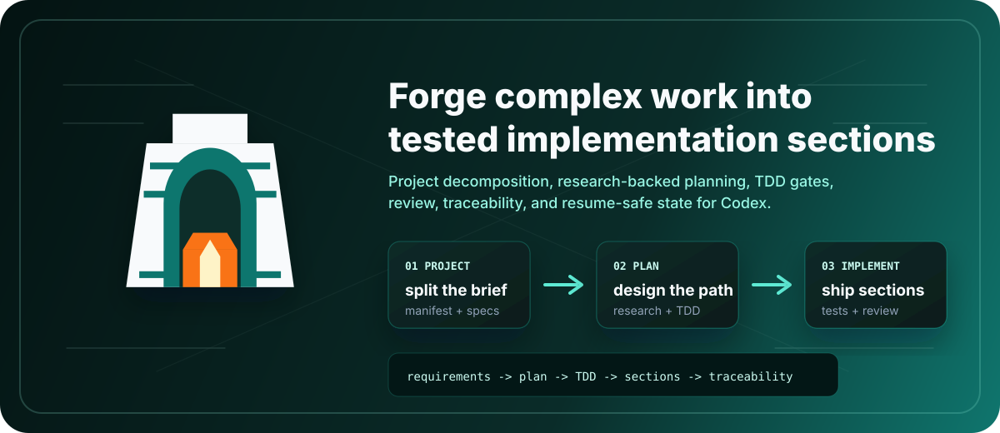
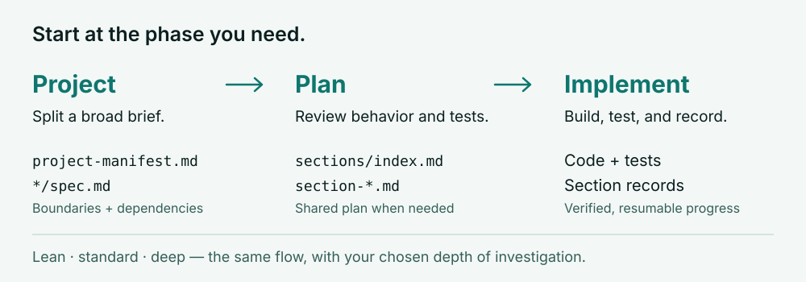

# Zagrosi Forge

<p>
<picture>
  <source media="(max-width: 600px)" srcset="assets/readme-hero-mobile.svg" />
  
</picture>
</p>

Forge turns requests into compact plans, clear code, and verified changes.
One entry point handles features, fixes, and cleanup in Codex and Claude Code.
Lean mode is default: focused context, targeted checks, one final integration result.

[Install](#install) · [Use](#use) · [Workflows](#workflows) · [Engineering](#engineering) · [Releases](docs/releases.md) · [Contribute](#contribute)

## Install

Requires Python 3.11+ and host plugin support. On Windows, replace `python3`
with `python` or `py -3`. Restart after installing or updating.

### Claude Code

```bash
claude plugin marketplace add zagrosi-code/zagrosi-forge
claude plugin install zagrosi-forge@zagrosi
```

Update with `claude plugin marketplace update zagrosi`, then
`claude plugin update zagrosi-forge@zagrosi`.

### Codex

```bash
codex plugin marketplace add zagrosi-code/zagrosi-forge
codex plugin add zagrosi-forge@zagrosi
```

<details>
<summary>Install or develop from a local checkout</summary>

```bash
git clone https://github.com/zagrosi-code/zagrosi-forge.git
cd zagrosi-forge
```

Claude Code can load this checkout for one session:

```bash
claude --plugin-dir "/absolute/path/to/zagrosi-forge"
```

For Codex, run these from the checkout:

```bash
python3 scripts/zagrosi_skills.py install --pretty
# Preview without writing:
python3 scripts/zagrosi_skills.py install --dry-run --pretty
# Refresh from the updated checkout:
git pull --ff-only
python3 scripts/zagrosi_skills.py update-check --pretty
python3 scripts/zagrosi_skills.py self-update --pretty
```

The installer preserves unrelated settings and excludes development artifacts.

</details>

## Use

Open your repository and describe the task; request `standard` or `deep`
when needed. Try the [runnable first task](examples/first-task/README.md).

**Claude Code**

```text
/zagrosi-forge:zagrosi-forge Add this feature and finish verification.
/zagrosi-forge:zagrosi-cleanup Simplify this subsystem while preserving behavior.
```

**Codex**

```text
Use $zagrosi-forge:zagrosi-forge to add this feature and finish verification.
Use $zagrosi-forge:zagrosi-cleanup to simplify this subsystem while preserving behavior.
```

Both hosts share the same skills, runtime, and engineering standards.
Forge adds no hooks, MCP servers, or background processes.
The original `zagrosi-project`, `zagrosi-plan`, and `zagrosi-implement` skills
remain available for direct phase control. Planning-only requests stop at the plan.

## Workflows

<p>
<picture>
  <source media="(max-width: 600px)" srcset="assets/readme-workflow-mobile.svg" />
  
</picture>
</p>

| Workflow | Output |
|---|---|
| Project | `project-manifest.md` and child `spec.md` files |
| Single-section plan | `sections/index.md` and one canonical section with tests, evidence, decisions, risks, and review |
| Multi-section plan | One shared plan and ordered sections linking shared contracts |
| Implement | Code, tests, and machine-readable section records |
| Cleanup | Simpler responsibilities and preserved behavior, with regression evidence |

| Depth | Use |
|---|---|
| `lean` — default | Minimum sufficient artifacts and focused checks |
| `standard` | Wider research, traceability, or coordination |
| `deep` | High-risk or architecture-heavy work |

Depth changes investigation and review rigor. Every mode retains requirements,
ownership, acceptance, and verification, without prose quotas or duplicate ledgers.

Skills handle setup and final checks; complete draft contracts before coding. See the
[compact-plan format](skills/zagrosi-plan/references/plan-format.md),
[depth standards](skills/zagrosi-plan/references/depth-standards.md), and
[example briefs](examples/gallery/README.md).

### Resume and compatibility

Ask Forge to continue from the planning directory, including after switching hosts.
Saved checkpoints retain progress; ownership conflicts serialize parallel work.
Contract/code changes invalidate final verification. Legacy evidence remains
readable but cannot establish new verified completion.

Run helpers **from the Forge checkout**, using absolute paths for external plans.

```bash
python3 scripts/zagrosi_skills.py status --path "/absolute/path/to/planning/01-auth" --pretty
python3 scripts/zagrosi_skills.py commands --pretty
python3 scripts/zagrosi_skills.py --help
```

`fast` aliases `lean`; existing `zagrosi-*`, `deep-*`, `DEEP_META`, and migrated
`claude-*` artifacts remain accepted. `codex_review` aliases `agent_review`.

[Detached execution](skills/zagrosi-implement/references/detached-frozen.md) retains
its pinned evidence protocol and physical contracts; privileged handoff requires
Darwin/arm64 and APFS.

## Engineering

The shared [engineering standard](skills/zagrosi-implement/references/engineering.md)
draws on [Ponytail](https://github.com/DietrichGebert/ponytail): trace callers, reuse
code, prefer clear names and direct flow. Repair encountered duplication and mixed
responsibilities; update ownership, characterize behavior, run targeted regression
checks, then the full suite at integration.
Explicit cleanup can cover a repository; the ordinary final PR pass covers the
diff and affected callers. Public exports, errors, ordering, and side effects matter.

Context preserves complete sections, linked decisions/risks, and explicit omissions.
`context-brief` and `implementation-packet` default to 2,000 words (`--max-words`).
Broken links and oversized contracts fail explicitly. Failed flights link complete
reports; `--full-output` includes the nested payload.
Oversized section entry returns an executable retry with the required word budget.

The runtime loads modules on demand. SHA-256 binds runtime/test sources; verification
compiles those exact bytes without bytecode caches. Writes are locked and atomic.

[Helper benchmarks](examples/evals/performance.json) measure fixed fixtures.
[Coding trials](examples/evals/coding/README.md) separate host/model, accepted
completion, cleanup quality, time, and usage. Historical trials remain unchanged;
adapter support alone does not establish faster or better model output.

### Multiple models

Ask for independent reviews with selected Codex, Claude, or Gemini models. Forge
reuses native CLI logins, sends bounded packets, and keeps one primary writer.
Other providers can use an explicit executable adapter. Missing access, failed
requests, and unreported usage/model identity remain visible; no silent fallback.
See [provider setup and review](skills/zagrosi-forge/references/providers.md).

```bash
python3 scripts/zagrosi_skills.py provider-status --check-auth
```

## Contribute

Shared workflows: `skills/`; runtime: `scripts/forge/`; checks: `tests/` and
`examples/`; host metadata: `.codex-plugin/` and `.claude-plugin/`.

After runtime/test edits, run `python3 tools/update_runtime_manifest.py`.
After adding/removing package members, stage intended files and run
`python3 tools/update_package_manifest.py`.
CI covers Linux/macOS/Windows and native host packaging. Optional native validators
require their CLIs.

```bash
python3 tools/update_runtime_manifest.py --check
python3 tools/update_package_manifest.py --check
uv run --with pytest python -m pytest
python3 scripts/zagrosi_skills.py doctor --plugin-root . --strict --pretty
python3 scripts/zagrosi_skills.py release-check --plugin-root . --pretty
plugin-scanner verify .
claude plugin validate . --strict
```

[MIT License](LICENSE) · [Attribution](NOTICE.md)
